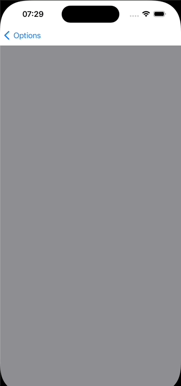

<br><br>
# PullToRefreshSwiftUI


- [Requirements](#requirements)
- [Installation](#installation)
- [Usage](#usage)
- [License](#license)

A `PullToRefreshScrollViewSwiftUI` is a custom control that alows to put some content on scroll with pull to refresh action.

`PullToRefreshSwiftUI` example:



## Requirements

- iOS 17.0+
- Xcode 15.0+
- Swift 5.9+

## Installation

### Swift Package Manager

**App dependency**

Select File > Add Package Dependencies and enter the repository URL ([Adding Package Dependencies to Your App](https://developer.apple.com/documentation/xcode/adding_package_dependencies_to_your_app))

**Package dependency**

Add `PullToRefreshSwiftUI` as a dependency in your `Package.swift` manifest:

```swift
dependencies: [
  .package(url: "https://github.com/shakurocom/PullToRefreshSwiftUI.git", from: "1.0.0")
]
```

### CocoaPods

To integrate PullToRefreshSwiftUI into your Xcode project with CocoaPods, specify it in your `Podfile`:

```ruby
pod 'Shakuro.PullToRefreshSwiftUI'
```

Then, run the following command:

```bash
$ pod install
```

### Manually

If you prefer not to use CocoaPods, you can integrate Shakuro.PullToRefreshSwiftUI simply by copying it to your project.

## Usage

Have a look at the [PullToRefreshSampleiOS](https://github.com/shakurocom/PullToRefreshSwiftUI/tree/main/PullToRefreshSample)

## License

Shakuro.PullToRefreshSwiftUI is released under the MIT license. [See LICENSE](https://github.com/shakurocom/PullToRefreshSwiftUI/blob/main/LICENSE.md) for details.

## Give it a try and reach us

Star this tool if you like it, it will help us grow and add new useful things. 
Feel free to reach out and hire our team to develop a mobile or web project for you.
