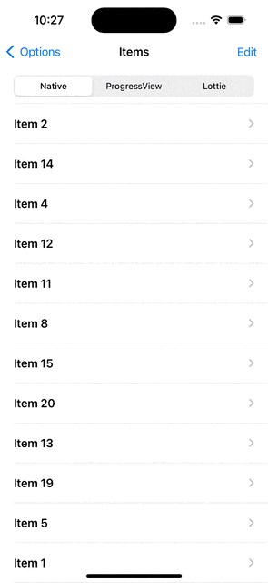

<br><br>
# PullToRefreshSwiftUI


- [ScrollView](#scrollview)
- [List](#list)
- [Requirements](#requirements)
- [Installation](#installation)
- [Usage](#usage)
- [License](#license)

`PullToRefreshSwiftUI` package contains `PullToRefreshScrollView` and `PullToRefreshListView` controls, that allows to add pull to refresh to ScrollView and List SwiftUI containers.


## ScrollView

A `PullToRefreshScrollView` is a custom control that alows to put some content on scroll view with pull to refresh action.

`PullToRefreshScrollView` example:

```swift
    PullToRefreshListView(
        pullToRefreshAnimationHeight: 100,
        pullToRefreshPullHeight: 100,
        isRefreshing: .constant(true),
        onRefresh: {
            debugPrint("Refreshing")
        },
        animationViewBuilder: { (state) in
            switch state {
            case .idle:
                Color.clear
            case .pulling(let progress):
                ProgressView(value: progress, total: 1)
                    .progressViewStyle(.linear)
            case .refreshing:
                ProgressView()
                    .progressViewStyle(.circular)
            case .finishing(let progress, let isTriggered):
                if isTriggered {
                    ProgressView()
                        .progressViewStyle(.circular)
                } else {
                    ProgressView(value: progress, total: 1)
                        .progressViewStyle(.linear)
                }
            }
        },
        contentViewBuilder: { _ in
            ForEach(0..<5, content: { (item) in
                Text("Item \(item)")
            })
        })
```


## List

A `PullToRefreshListView` is a custom control that alows to add some content to list view with pull to refresh action.

`PullToRefreshListView` example:

```swift
PullToRefreshListView(
    options: PullToRefreshListViewOptions(pullToRefreshAnimationHeight: 100,
                                          animationDuration: 0.3,
                                          animatePullingViewPresentation: true,
                                          animateRefreshingViewPresentation: true),
    isRefreshing: $isRefreshing,
    onRefresh: {
        debugPrint("Refreshing")
        DispatchQueue.main.asyncAfter(deadline: DispatchTime.now() + DispatchTimeInterval.seconds(5), execute: {
            isRefreshing = false
        })
    },
    animationViewBuilder: { (state) in
        switch state {
        case .idle:
            Color.clear
        case .pulling(let progress):
            ProgressView(value: progress, total: 1)
                .progressViewStyle(.linear)
        case .refreshing:
            ProgressView()
                .progressViewStyle(.circular)
        case .finishing(let progress, let isTriggered):
            if isTriggered {
                ProgressView()
                    .progressViewStyle(.circular)
            } else {
                ProgressView(value: progress, total: 1)
                    .progressViewStyle(.linear)
            }
        }
    },
    contentViewBuilder: { _ in
        ForEach(0..<5, content: { (item) in
            Text("Item \(item)")
        })
    })
```



## Requirements

- iOS 15.0+
- Xcode 15.0+
- Swift 5.9+

## Installation

### Swift Package Manager

**App dependency**

Select File > Add Package Dependencies and enter the repository URL ([Adding Package Dependencies to Your App](https://developer.apple.com/documentation/xcode/adding_package_dependencies_to_your_app))

**Package dependency**

Add `PullToRefreshSwiftUI` as a dependency in your `Package.swift` manifest:

```swift
dependencies: [
  .package(url: "https://github.com/shakurocom/PullToRefreshSwiftUI.git", from: "1.6.0")
]
```

### CocoaPods

To integrate PullToRefreshSwiftUI into your Xcode project with CocoaPods, specify it in your `Podfile`:

```ruby
pod 'Shakuro.PullToRefreshSwiftUI'
```

Then, run the following command:

```bash
$ pod install
```

### Manually

If you prefer not to use CocoaPods, you can integrate Shakuro.PullToRefreshSwiftUI simply by copying it to your project.

## Usage

Have a look at the [PullToRefreshSampleiOS](https://github.com/shakurocom/PullToRefreshSwiftUI/tree/main/PullToRefreshSample)

## License

Shakuro.PullToRefreshSwiftUI is released under the MIT license. [See LICENSE](https://github.com/shakurocom/PullToRefreshSwiftUI/blob/main/LICENSE.md) for details.

## Give it a try and reach us

Explore our expertise in <a href="https://shakuro.com/services/native-mobile-development/?utm_source=github&utm_medium=repository&utm_campaign=pull-to-refresh">Native Mobile Development</a> and <a href="https://shakuro.com/services/ios-dev/?utm_source=github&utm_medium=repository&utm_campaign=pull-to-refresh">iOS Development</a>.</p>

If you need professional assistance with your mobile or web project, feel free to <a href="https://shakuro.com/get-in-touch/?utm_source=github&utm_medium=repository&utm_campaign=pull-to-refresh">contact our team</a>
